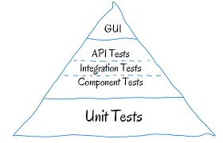

# QA challenge

Hola, bienvenid(@) a la prueba para el puesto QA Engineer, a continuación encontrarás una serie de retos que deberás realizar, recuerda que estos no son ejercicios de calificación, no hay respuestas válidas o inválidas,
# RETO 1
En el área de TI de UTP surgió el requerimiento de realizar un nuevo proceso de autenticación. Nuestro scrum master registro las siguientes requerimientos:

 - Nueva funcionalidad de login
 - Nueva funcionalidad de registro

### Historia de usuario
Como usuario nuevo deseo poder registrarme en la web y poder loguearme de manera satisfactoria

### Criterios de aceptación
Los criterios de aceptación para el registro son los siguientes:

- El correo ingresado debe tener un @ para ser válido.
- La contraseña debe tener como mínimo 5 caracteres.
- El correo y la contraseña son requeridos obligatoriamente.
- El sistema debe mostrar un mensaje de error al ingresar campos no válidos.

Los criterios de aceptación para el login son los siguientes:

- El correo ingresado debe tener un @ para ser válido.
- La contraseña debe tener como mínimo 5 caracteres.
- El correo y la contraseña son requeridos obligatoriamente.
- El sistema debe mostrar un mensaje de error al ingresar campos no válidos.

El equipo de desarrollo realizo sus tareas y ahora te toca a ti certificar que dichas actividades se realizaron correctamente 🙌. 

** Todos los requerimientos deben ser considerados tanto para para parte front como para la parte back del sistema.

### Pasos

Descarga el proyecto 🗂 y levanta🔥los servicios :

    $ git clone https://github.com/djego/recruiting-qa-challenge.git
    $ cd recruiting-qa-challenge
    $ cd back/
    $ npm run start
    $ cd ..
    $ cd front/
    $ npm run start

** En este repositorio se encuentra la parte front como la parte back del reto, cada una debe ser ejecutada por separado para comenzar con el challenge.

### Objetivos
Crea un documento ( qa-challenge-reto1[nombre].docx ) para colocar los resultados de los siguientes objetivos

 1. Identifica los tipos de casos de prueba que estarían enlazadas a las requerimientos propuestos. 
 2. Menciona que técnica de diseño de casos de prueba usarías para poder generar dichos casos ( qa-challenge-reto1[nombre].docx )
 3. Identifica, registra y describe los bugs o mejoras que consideres necesarios  ( qa-challenge-reto1[nombre].docx )
 3. Implementa los tipos de pruebas automatizadas que consideres necesarios (unitarias, servicios, ui , perfomance), de tal manera que se pueda evaluar los requerimientos solicitados. Se debe crear un proyecto en una carpeta aparte llamada qaChallenge (utiliza el framework de automatización que prefieras y deberas subirlo a tu repositorio). 

# RETO 2

 ### Entornos de trabajo y niveles de pruebas

El equipo maneja varios ambientes de trabajo (desarrollo, qa, uat, produccion) a lo largo del desarrollo del producto. Consideramos que la calidad debe asegurarse en todo el flujo, por lo tanto diferentes pruebas debes realizarce en cada uno de los ambientes propuestos.

Ambientes: 
Niveles de pruebas : 
 

 ### Objetivos
 Crea un documento ( qa-challenge-reto[nombre].docx ) para colocar los resultados de los siguientes objetivos

 1. Comenta en base a tu criterio que nivel(es) de pruebas aplicaría para cada ambiente (puedes sugerir otros ambientes u estructura si es que lo consideras) ( qa-challenge-reto2[nombre].docx )

# RETO 3

 ### Priorización de errores 

# Caso:
Imagina una herramienta web, desarrollada con el objetivo de proporcionar una versión de ancho de banda ligero (se requiere un uso óptimo alrededor de 50 MB) de una herramienta principalmente utilizada por personas de todo el mundo para comprar productos de segunda mano.

Defectos: 
1. Los precios no varían cuando una transacción se realiza en diferentes monedas.
2. Las transacciones entre usuarios no se reflejan en un informe de back-end.
3. Hay algunos errores ortográficos en la página de inicio.
4. Las credenciales de usuario no están cifradas en la base de datos.
5. Los foros oficiales de soporte no siempre registran los comentarios del usuario.
6. El ancho de banda necesario para una experiencia de usuario óptima es una velocidad de descarga de 100 MB.

 ### Objetivos
 Para el siguiente conjunto de defectos, prioriza del 1 al 6, siendo el primero el más crítico y explique brevemente por qué (puedes incluir alguna suposición). Coloca tus respuestas en el  documento ( qa-challenge-reto[nombre].docx ) y coloca tu respuesta

 # RETO 4

 ### Agile testing 

# Caso:

La aplicación web a probar es una plataforma como Mercado Libre. A continuación, podrás encontrar una lista de técnicas y procedimientos utilizados en las pruebas

El equipo de pruebas : 
1. Utiliza el mismo entorno que los usuarios finales para realizar las pruebas perfomance.
2. Las pruebas de humo se ejecutan para cubrir todas las posibles opciones del usuario y se realizan en cada implementación de una nueva versión, todas las pruebas se realizan manualmente para reflejar la misma experiencia del usuario.
3. Las pruebas de regresión solo cubren los módulos que probablemente se vean afectados por los cambios realizados en la última versión..
4. Los casos de prueba se crean en Excel para que sean fáciles de editar. Los casos de prueba se eliminan después de la implementación de esa versión, por lo que se crean nuevos completos en cada iteración.
5. Las pruebas comienzan a estar involucradas en el proceso de desarrollo desde la etapa inicial.

 ### Objetivos
Evalúa si son los procedimientos de la lista son los más adecuados. Brinda una alternativa /  tipo de pruebao mejora para las que no son adecuadas desde tu punto de vista. Crea un documento ( qa-challenge-reto4[nombre].docx ) y coloca tu respuesta

Recuerda publicar tus respuestas en el repositorio de tu preferencia y envíanos un correo con el link y tu archivo a: dsanchezb@inlearning.edu.pe

Ante cualquier duda puedes enviar un correo a dsanchezb@inlearning.edu.pe y estaremos encantados de ayudarte. 

Exitos y gracias por tu tiempo!😃

